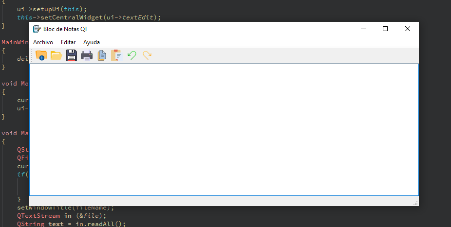

# Bloc de Notas con Qt v15.0.0 y C++ 

## Descripción
Un bloc de notas funcional desarrollado con Qt y C++, que ofrece herramientas de edición de texto.
Este proyecto es parte de mi aprendizaje en con nuevos lenguajes como C++ y frameworks como QT 😃.

## Características
- Interfaz gráfica intuitiva desarrollada con Qt
- Edición de texto completa
- Guardar archivos
- Copiar y pegar
- Imprimir documentos
- Soporte para múltiples operaciones de texto
- Implementación en C++ moderna

## Funcionalidades Principales
- 📝 Edición de texto avanzada
- 💾 Guardar archivos en diferentes formatos
- 📋 Operaciones de portapapeles (Copiar, Cortar, Pegar)
- 🖨️ Impresión directa de documentos
- 📂 Abrir archivos existentes
- ✂️ Herramientas de formato de texto

## Requisitos
- Qt 6.x
- Compilador C++ 
- CMake o Qt Creator

## Instalación
```bash
mkdir build
cd build
cmake ..
make
```

## Capturas de Pantalla
<div align="center">

</div>

## Tecnologías
- C++
- Qt Framework
- CMake

## Contribuciones
Contribuciones son bienvenidas. 

## Autor
Gabriel Calcagni - solidsnk86
